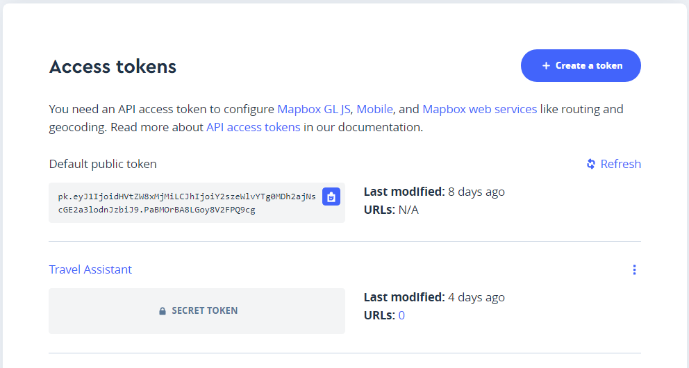

<h2><b>Bước 1:</b></h2>

<t>Đăng ký tài khoản tại https://account.mapbox.com/auth/signin/</t>

<h2><b>Bước 2:</b></h2>

<t>Lấy Access tokens tài khoản của bạn</t>

<h2><b>Bước 2:<h2><b>
 
<t> Lấy Access tokens tài khoản của bạn
<t>
Bước 3: Cài đặt Mapbox SDK cho project của bạn:
